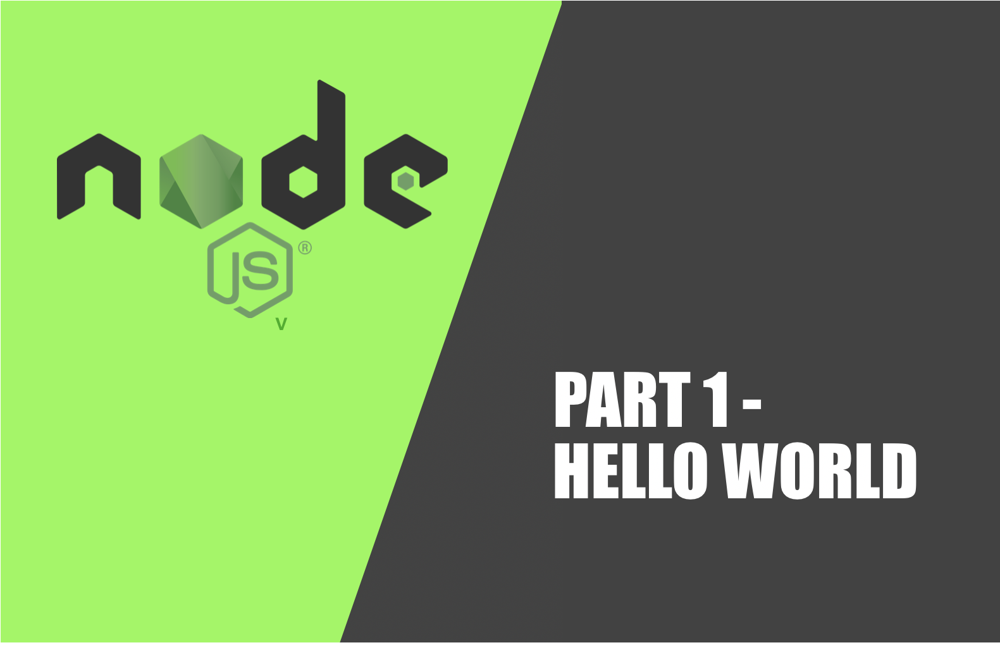

**Introduction**

This is a post that I'm using as my first post in my new blog and it's about node JS and it's for beginners and hopefully, it will help you start developing apps with javascript.

In a nutshell, NodeJS is a runtime that allows us to run javascript outside the browser or
in other words to run javascript in our operating system as any other traditional languages like Java, PHP, C and so on.

I'll post some more advanced details of Node internals in the future.

**Install**

Before you install Node JS I will first recommend you to use Linux or Mac OS or Docker. Use a virtual machine if you need to but I can't recommend node js in Windows since a lot of the stuff you will find on google will be based on the nix\* based OS.

Once we have decided the OS we want to use, we can go to the official website and download the last version of Node JS but instead of this, it's suggested you install Node js by using a tool called NVM. Nvm is a tool that will help you install Node js and choose differents versions of Node js in different projects in your local.

Here you have a complete guide to install nvm in the OS of your choice https://gist.github.com/d2s/372b5943bce17b964a79

In this post I'm going to install and run everything in a Macbook, but everything is quite similar for the rest of the OS.

```bash
$ curl -o- https://raw.githubusercontent.com/nvm-sh/nvm/v0.34.0/install.sh | bash
```

if no errors appear you will see that it suggest you to run this command

```bash
$ source ~/.bashrc
```

After running source command you will be able to run nvm anywhere from the terminal. An alternative to this is to simply restart the terminal and the command will be also available.

Then at this point we can install Node js in the version we prefer. In order to do that we can list all the available versions first.

```bash
$ nvm ls

   v4.9.1
         v6.0.0
         v6.1.0
        v6.11.1
        v6.17.1
         v8.6.0
         v8.9.1
->      v8.11.3
        v10.0.0
       v10.16.0
        v11.9.0
         system
default -> 8 (-> v8.11.3)
node -> stable (-> v11.9.0) (default)
stable -> 11.9 (-> v11.9.0) (default)
```

As you can see at the moment of writing this the latest node version is 11.9 but we can choose any one we prefer, it's usual to use versions for a lot of legacy code you will find out there. For this tutorial we are going to use the latest so we have to run this command.

```bash
$ nvm install 11.9
```

Now we can run Node js for the very first time in order to get the current installed version.

```bash
$ node --version
v11.9.0
```

**Finally the HelloWorld.js promised**

Ok can you feel it ? We 're ready to go and create our first javascript file and write down our piece of art code.

```bash
$ mkdir hello-world
```

by the way, notice that the folder names are a lower case separated with dashes, this is the accepted naming convention by the majority of the node js community.

Inside this folder we're going to create the js file

```bash
$ touch helloWorld
```

and you can edit this file with your prefered editor and write

```javascript
console.log("Hello World!");
```

and in order to run our master piece

```bash
$ node helloWorld.js
Hello World!
```

Ok, so that's it for the moment. Maybe you're wondering, is this is the common way to create node js project properly? Not at all, I would say :) The common way to create a new project in node js is by using another interesting cli tool called NPM, but this is for another quick and dirty node js guide.

you can ping me in twitter @servatj any question you have if you like it then post and you're waiting for more and so on...
