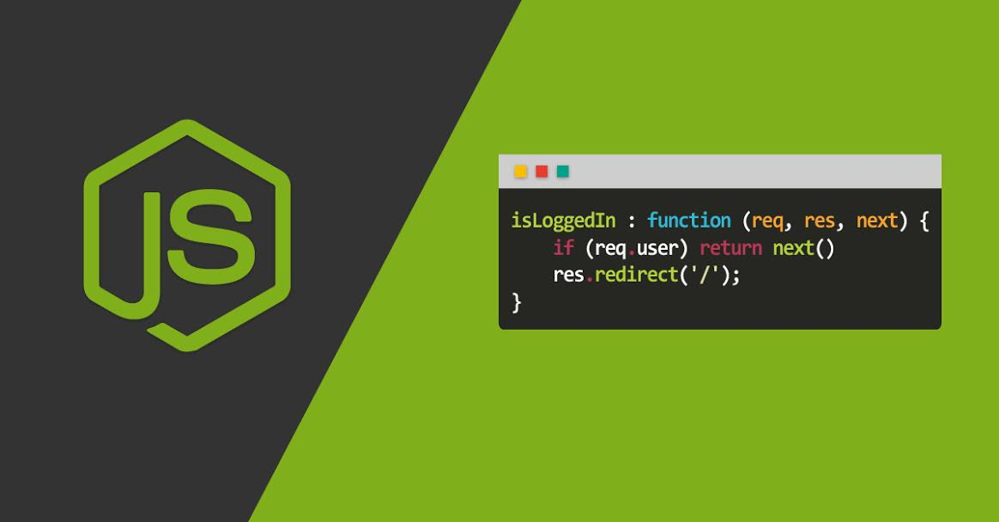

## Introduction

This is the second part of the series about learning node js in this blog. In the previous [post](/hello-world-in-node-js) we installed node js and ran our first script. In this post, the idea is to create a more advanced project.

We're going to create a very rudimentary bot. The idea is to start with a bot that greets the user ask for his name. Then we can continue adding more features like the ability to tell us the time or the news.

In our journey, the idea is to learn both some important concepts about javascript and node js but I recommend you to look and combine the content of this series with other javascript sources out there in a more formal way 😉 But the idea again is to help you get traction on node js.

## npm


This is the tool we use to create a new project in Nodejs. As you can see in the image below the title npm is a registry of node js packages npmjs.com and it also the name of the tool that gets installed within node js.

The most important and common things we can do with npm are:

 **npm init** --> to create a new node js project
 **npm install** --> to install packages ( node js libraries/modules )
 **npm publish** --> to publish our own libraries to npm.com

So let's use it go ahead open a terminal and run;

```sh
 $ mkdir node-bot && cd node-bot
```

we first need to create a new folder for our project, the convention
in node js is to separate the words by "-", for instance, this can be another accepted name this-is-my-awesome-project.

time to run npm init

```sh
 $ npm init
```

it will prompt you some questions

```js
This utility will walk you through creating a package.json file.
It only covers the most common items and tries to guess sensible defaults.

See `npm help json` for definitive documentation on these fields
and exactly what they do.

Use `npm install <pkg>` afterwards to install a package and
save it as a dependency in the package.json file.

Press ^C at any time to quit.
package name: (bot)
```

The first prompt is where we can set the name of the project, this should follow the same convention mentioned previously about the naming to use in our folders, node-bot, so it's very common to use the same name, you can leave the prompt blank and hit enter.

```sh
version: (1.0.0)
```

You can set the number of the version you like in my case I prefer to start by using 0.0.0 when bootstrap but versioning our projects, components etc is something I will dedicate a full post in this blog in the near future. For the moment X.0.0 the x in the left is for major versions, this usually means that something changed so much that is no longer compatible with previous versions. In case of the middle figure 0.X.0 this usually means a new feature in your project and finally the last X means a patch for a bug.

```sh
description: This is my awesome bot.
```

Another prompt is to set a brief description of our project.

```sh
entry point: (index.js)`
```

this is the entry point of our node js app, by default node js was created to run index.js as default when you import a package. So this field can be a bit confusing at this point. Just you have to keep in mind that this is the entry point for other projects that can use our package as a library.

we can hit enter for the rest of the options and write yes in the last one. We can see


```sh
test command:
git repository:
keywords:
license: (MIT)
About to write to /Users/servatj/node-bot/package.json:
{
 "name": "bot",
 "version": "0.0.1",
 "description": "This is my Awesome bot",
 "main": "index.js",
 "scripts": {
 "test": "echo \"Error: no test specified\" && exit 1"
 },
 "author": "Servatj <josep.servat@guidesmiths.com>",
 "license": "MIT"
}

Is this ok? (yes) yes
```

Ok, so we can see that npm has created a package.json file inside the folder of our project in JSON format. JSON - Java Script Object Notation - is a way to format data, for now, the left part before the colon is what we call a key as in name and the right part of the colon is the value contained in the key. For example, name is the key a bot is a value. Everything needs to be double-quoted to be considered JSON.

We can any time to edit our package.json and the common practice to create our project with npm init is by using

```
$ npm init -y
```

This way it will autocomplete all the questions and we usually edit all the properties we want without the terminal wizard.

## Picking an editor.

Now is probably a good time to open our project with our prefered editor. in my case I use vscode and of course, in 2019 I highly recommend to use it for any project you start in node js or even in other languages.


Hopefully this you can see your recent created package.json file.

## Git - repo

In order to keep track of your changes, if you still don't know, to use control version tool and especially git that is world wide accepted.

I Will not explain how to create a new repository in github this post but I will try to indicate the steps you need to perform

 1 - Install git in your computer
 2 - Create a github account
 3 - Setup git
 4 - For Mac users you can install hub to create your repos quicker

once you have everything installed in the terminal you can run

```
 $ git init
```

This command will create a local git repository

```
 $ git add .
```

add stages the files for committing them

```
 $ git commit -m "initial commit "
```

```
 $ git push
```

If you have set everything ok push command will push your changes to your repo. In my case, you can get the repo in https://github.com/servatj/node-bot.

Let me know if you need help on this in my [discord](https://discord.gg/3hZfAn) channel.

## npm scripts

Ok, so far we have nothing runnable yet, in the previous bot we were able to run our script by using the node command + the name of the script. But again there is a more pro way to do that, and you guessed by using npm scripts tags.

Before we continue i want to comment that, the common example that you will find everywhere as your first node js tutorial is the classic http server that responds to a request.

But in this tutorial I will move slower and understand that node js is not a framework to create web apps, node js is a runtime that runs javascript on the server-side.

Now, create a new file in the root folder of your project called main.js

we can start by putting a console.log there

```javascript
 console.log('Hello I am a bot 🤖 👋')
```

(you can add an emoji in a mac with cmd+control+space )

we can run this as **node main.js** or we can add a script tag in our package JSON and run it with **npm run start**

npm run + name of the script you want to run

```JSON
{
 "name": "bot",
 "version": "0.0.1",
 "description": "This is my Awesome bot",
 "main": "index.js",
 "scripts": {
 "test": "echo \"Error: no test specified\" && exit 1"
 },
 "author": "Servatj <josep.servat@guidesmiths.com>",
 "license": "MIT"
}
```

By default, we can see that npm tool has created one script for tests called test that it has a message by default indicating you that it's not properly set.

if you run **npm run test**, you will see the error message

```sh
> bot@0.0.1 test /Users/user/node-bot
> echo "Error: no test specified" && exit 1

Error: no test specified
npm ERR! code ELIFECYCLE
npm ERR! errno 1
npm ERR! bot@0.0.1 test: `echo "Error: no test specified" && exit 1`
npm ERR! Exit status 1
npm ERR!
npm ERR! Failed at the bot@0.0.1 test script.
npm ERR! This is probably not a problem with npm. There is likely additional logging output above.
npm WARN Local package.json exists, but node_modules missing, did you mean to install?

npm ERR! A complete log of this run can be found in:
```

Let's add a start script in package json, this will allow us to ***npm run start*** script.

```JSON
{
 "name": "bot",
 "version": "0.0.1",
 "description": "This is my Awesome bot",
 "main": "index.js",
 "scripts": {
 "start": "node main.js",
 "test": "echo \"Error: no test specified\" && exit 1"
 },
 "author": "Servatj <josep.servat@guidesmiths.com>",
 "license": "MIT"
}
```
if we run the created script we can see our app run.

```sh
npm run start

> bot@0.0.1 start /Users/servatj/node-bot
> node main.js

Hello I am a bot 👋

```

## Prompts in node js

At this point, we can change the main.js file and run it anytime with npm run start.

So now it's time to play with more node js and more javascript.

We want to add our bot the ability to prompt a question ask our name and respond accordingly. For that, we 're going to use a third-party package in npm registry that will help us to do it easily, [prompt-sync](https://www.npmjs.com/package/prompt-sync). "<small>There are more ways to prompt a message in node with the core libraries but we will need to explain more advanced topics that we will see in further posts.</small> "

The first thing we need to do is to install the package, we use npm like this:

```
 npm install prompt-sync --save
```

Then we can import this new package in our main.js file

```javascript
 prompt = require('prompt-sync')();

 console.log('Hello I am a bot 👋 ')

```
now we're ready to use it after the first greeting

```javascript
const prompt = require('prompt-sync')();

console.log('Hello I am a bot 👋 ')

const name = prompt('What is your name? ');

console.log('Nice to meet you ' + name + '!');
```

Ok many things happened here, we required our package and named as prompt
then the app printed the initial greetings, then our bot prompted our name and stored the value in name variable and finally, it prints our message wrapped in a standard greeting. Yayyy!

At this point I think it's enough for this post you can try to play with console log, running, prompting etc

In the next post, we will see what is sync word and his counterpart async, what is a callback and how our bot will get and fetch forecast data from the internet.

This is the second part of the series about learning node js in this blog. In the previous [post](/hello-world-in-node-js) we installed node js and ran our first script. In this post, the idea is to create a more advanced project.

We're going to create a very rudimentary bot. The idea is to start with a bot that greets the user ask for his name. Then we can continue adding more features like the ability to tell us the time or the news.

In our journey, the idea is to learn both some important concepts about javascript and node js but I recommend you to look and combine the content of this series with other javascript sources out there in a more formal way 😉 But the idea again is to help you get traction on node js.
